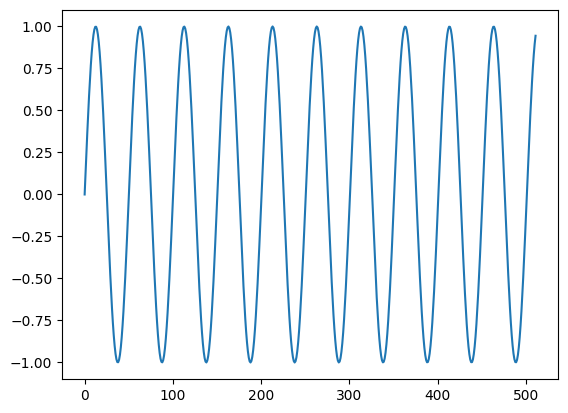
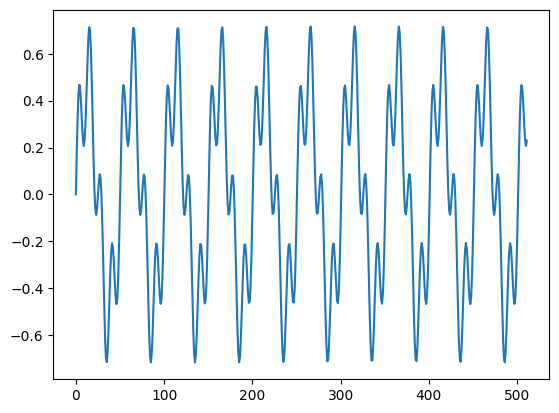
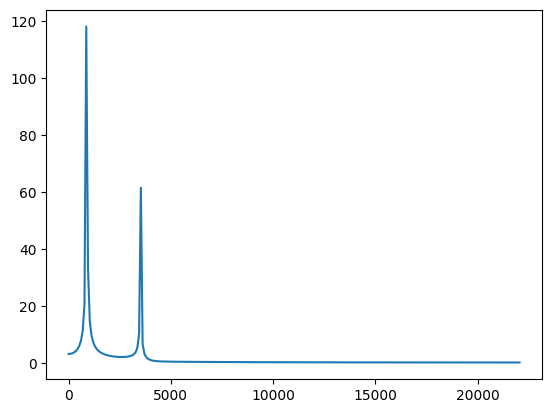

```python
%pip install numpy
%pip install matplotlib
```

    Requirement already satisfied: numpy in ./env/lib/python3.13/site-packages (2.3.1)
    
    [notice] A new release of pip is available: 24.3.1 -> 25.1.1
    [notice] To update, run: pip install --upgrade pip
    Note: you may need to restart the kernel to use updated packages.
    Requirement already satisfied: matplotlib in ./env/lib/python3.13/site-packages (3.10.3)
    Requirement already satisfied: contourpy>=1.0.1 in ./env/lib/python3.13/site-packages (from matplotlib) (1.3.2)
    Requirement already satisfied: cycler>=0.10 in ./env/lib/python3.13/site-packages (from matplotlib) (0.12.1)
    Requirement already satisfied: fonttools>=4.22.0 in ./env/lib/python3.13/site-packages (from matplotlib) (4.58.5)
    Requirement already satisfied: kiwisolver>=1.3.1 in ./env/lib/python3.13/site-packages (from matplotlib) (1.4.8)
    Requirement already satisfied: numpy>=1.23 in ./env/lib/python3.13/site-packages (from matplotlib) (2.3.1)
    Requirement already satisfied: packaging>=20.0 in ./env/lib/python3.13/site-packages (from matplotlib) (25.0)
    Requirement already satisfied: pillow>=8 in ./env/lib/python3.13/site-packages (from matplotlib) (11.3.0)
    Requirement already satisfied: pyparsing>=2.3.1 in ./env/lib/python3.13/site-packages (from matplotlib) (3.2.3)
    Requirement already satisfied: python-dateutil>=2.7 in ./env/lib/python3.13/site-packages (from matplotlib) (2.9.0.post0)
    Requirement already satisfied: six>=1.5 in ./env/lib/python3.13/site-packages (from python-dateutil>=2.7->matplotlib) (1.17.0)
    
    [notice] A new release of pip is available: 24.3.1 -> 25.1.1
    [notice] To update, run: pip install --upgrade pip
    Note: you may need to restart the kernel to use updated packages.


```python
import numpy as np
import matplotlib.pyplot as plt
```


```python
samplerate = 44100  # samples per second
rootnote = 880  # A-note, 880Hz
framelength = 512
```


```python
times = np.arange(framelength)
amplitudes = np.sin(2 * np.pi * rootnote * times / samplerate)

plt.plot(times, amplitudes)
plt.show()
```


    

    


```python
secondnote = rootnote * 4

signal1 = np.sin(2 * np.pi * rootnote * times / samplerate)
signal2 = np.sin(2 * np.pi * secondnote * times / samplerate) * 0.5  # Half volume
amplitudes = (signal1 + signal2) / 2

plt.plot(times, amplitudes)
plt.show()
```


    

    


```python
frequencies = np.fft.fftfreq(framelength, d=1/samplerate)  # Horizontal axis from -samplerate/2 to samplerate/2
freq_amplitudes = np.abs(np.fft.fft(amplitudes))  # Positive Frequency Amplitudes

plt.plot(frequencies, freq_amplitudes)
plt.show()
```


    

    


```python
frequencies2 = np.fft.rfftfreq(framelength, d=1/samplerate)  # Horizontal axis from 0 to samplerate/2
freq_amplitudes2 = np.abs(np.fft.rfft(amplitudes))  # Positive Frequency Amplitudes

plt.plot(frequencies2, freq_amplitudes2)
plt.show()
```


    

    

